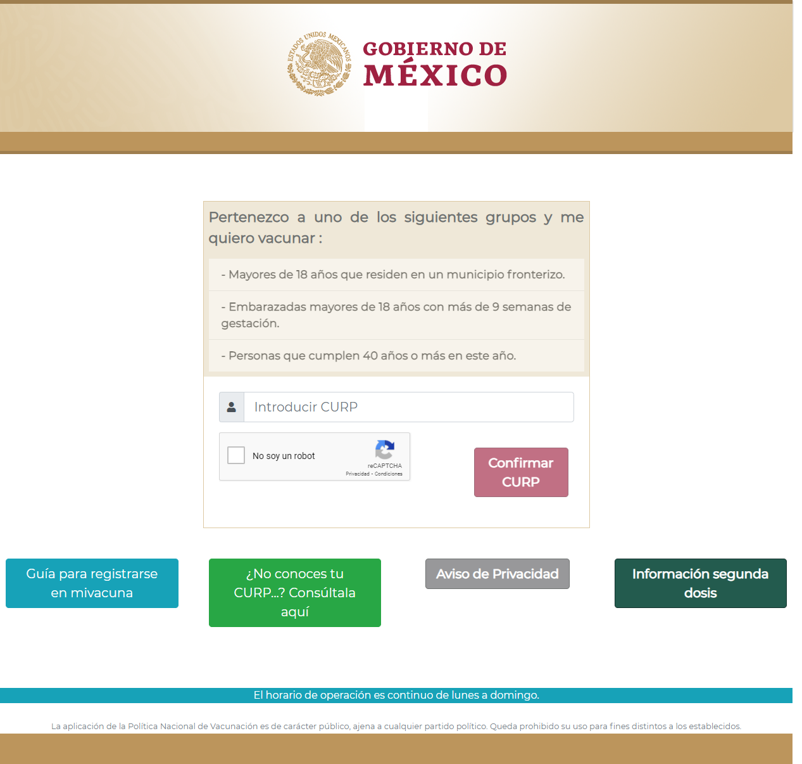

# Proyecto Final "Mi Vacuna"
## Curso: _Programación Web_

Este proyecto esta en  desarrollo con las siguientes tecnologías:

> _*También un poco de ajax_
### El proyecto consiste en configurar un sitio dinámico con un diseño y funcionamiento similar al de la página de [MiVacuna](https://mivacuna.salud.gob.mx/index.php).

